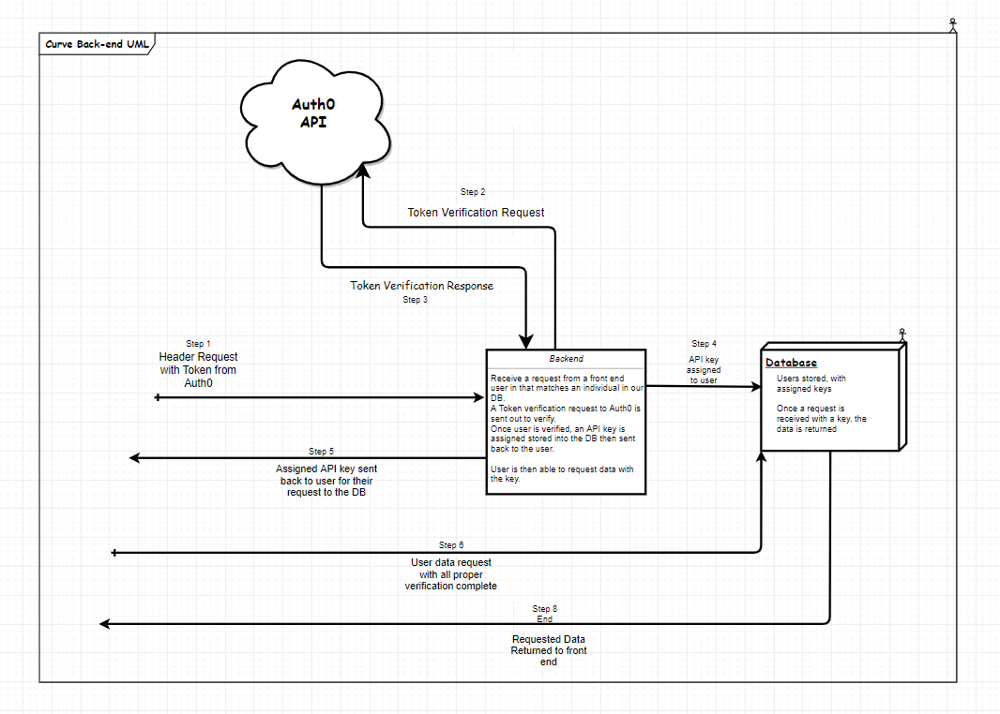

 

# Curve: Repository Name

## DESCRIPTION

### Contributors

  
<b>Integrations Team Liasons</b>

  <ul>
    <li>Jason Burns, Auth Liason (https://github.com/jasonb315)</li>
    <li>Andrew Curtis, GraphQL Liason (https://github.com/amjcurtis)</li>
  </ul>

  
<b>Auth Team</b>

  <ul>
    <li>Tanner Percival, Lead Developer (https://github.com/Tanner253)</li>
    <li>Andrew Roska, Developer (https://github.com/Roketsu86)</li>
    <li>Ben Taylor, Developer (https://github.com/BenSTay)</li>
  </ul>

  
<b>GraphQL Team</b>

  <ul>
    <li>Daniel Logerstedt, Lead Developer (https://github.com/daniellogerstedt)</li>
    <li>Ian Gifford, Developer (https://github.com/IanGifford261)</li>
    <li>Michael Kelly, Developer (https://github.com/Michael-S-Kelly)</li>
    <li>Christopher Morton, Developer (https://github.com/cmorto02)</li>
  </ul>

#### Auth Team Goal
Utilize OAuth for google and github through Auth0 (Library of OAuth providers) to quickly and seamlessly allow users to register and use the site as inteded. a couple of things to keep in mind about Auth0 is that there is a default and mandatory 
timeout for the access token where a new one is generated on login or register. this means that the access token is not persistant and becomes very difficult to validate.

#### GraphQL Team Goal
Build a responsive GraphQL endpoing that has the ability to perform full CRUD operations with an attached database to store periodic review information based on the list of core competencies. As well as the ability to post comments for any given section of a review.

##### SUB HEADERS

## Repo Purpose

Authentication, GraphQL, and Database code for the backend portion of the Curve prototype.

## Client Requirements

Use Auth0
Use GraphQL
Use multiple roles
maximize security

## Deployment Link

The deployed API can be hit from [This](https://cfcurve.azurewebsites.net/graphql) location.

## Frameworks and Tools Used

.NET Core 
GraphQL (API Endpoint Management)
JWT
Auth0
EntityFramework (SQL Management)

#### And Rational for that choice

The reason we chose to use Auth0 was because the client wanted the ability to OAuth with multiple different services, and Auth0 handles the requests and responses of verification 
securely. We are utilizing a controller to handle the actions to and from Auth0 and a model to store the proper data to verify the user.

GraphQL was chosen for use in building the API because it was a hard requirement of the client. It was decided this would be used by the client because it allows dynamic and quick loading of data from the database that isn't restricted to a specific shape or type.

## UML

#### Backend UML

## Process flow

#### Auth Team
9 AM : Meet up and deligate work for the day 
10 AM: Team meeting (usually resulted in a pivot)
11  PM: Stand up and sync (soetimes a pivot)
4 PM : Stand up to sync with the other teams

  
<b>GraphQL Team Schedule</b>

    <ul>
      <li>0900-1030: Meet up for internal team plan of the day.</li>
      <li>1030-1100: Standup meeting.</li>
      <li>1100-1130: Team leadership meeting.</li>
      <li>1145-1300: Break for lunch as needed.</li>
      <li>1300-1600: Work with other teams.</li>
      <li>1600-1630: Standup meeting.</li>
      <li>1630-1700: Work with other teams.</li>
      <li>1700-1730: Scrum of Scrums.</li>
      <li>1730-1800: End of day meet up.</li>
  </ul>

## Current functionality

The current functionality is that the front end will handle the retriveal of the token and the authentication of a user.

#### GraphQL
The GraphQL endpoint can currently receive queries to GET data and send data as requested. It can also be used to put data into and edit data inside the database.

## Known bugs 

#### Existing limitations, etc
Cannot send user information over http requests (security vulnerability)
- CANNOT use graphQL and a form of authentication through auth0
- MUST validate access token with Auth0 for a x amount of time. reoccurring, every request is different token - no persistence == the idea of renewing the token often increases security immensely

## Tasks remaining 

Adding more roles to facilitate more or less accessibility per user.
If we were not using GraphQL or this project was in one repo most of the issues are solved

#### TODOs

increase security for authorization for the data retrieval for the front end

## Recomendations for future development

look into this doc
[image of known solution proof on github ](assets/MediumBlog.JPG)
https://medium.com/volosoft/building-graphql-apis-with-asp-net-core-419b32a5305b

Explains what our problem is and why it exists.
## Docs Referenced (links)

* [Auth Resource 1:](https://auth0.com/docs)
* [Auth Resource 2:](https://auth0.com/docs/quickstart/backend/aspnet-core-webapi)
* [GraphQL Resource 1: https://graphql-dotnet.github.io/docs/getting-started/introduction/](https://graphql-dotnet.github.io/docs/getting-started/introduction/)
* [GraphQL Resource 2: https://medium.com/volosoft/building-graphql-apis-with-asp-net-core-419b32a5305b](https://medium.com/volosoft/building-graphql-apis-with-asp-net-core-419b32a5305b)

<!-- ##### SUB HEADERS -->
<!--
 xof nworb kciuq eht xof nworb kciuq eht xof nworb kciuq eht xof nworb kciuq eht xof nworb kciuq eht xof nworb kciuq eht xof nworb kciuq eht xof nworb kciuq eht xof nworb kciuq eht xof nworb kciuq eht xof nworb kciuq eht xof nworb kciuq eht xof nworb kciuq eht 
-->
***

footnotes
# RAW DOCUMENTATION PLEASE READ!
https://github.com/CodeFellows-Curve/dotnet-api/blob/pre-staging/curve-api/curve-api/README-Auth.md

<!-- Lengthy lists of things? Use: -->
<!--

  
<b>List Title</b>

    <ul>
      <li></li>
      <li></li>
      <li></li>
      <li></li>
    </ul>

 -->

<!-- Endpoints? Methods? Arguments? Can use: -->
<!-- 
| Method | Use | Big O Time | Big O Space | IN | OUT |
| :----------- | :----------- | :-------------: | :-------------: | :-----------: | :-----------: |
| Method | desc | O(n) | O(n) | DICT | LIST |
 -->

------------------------------
